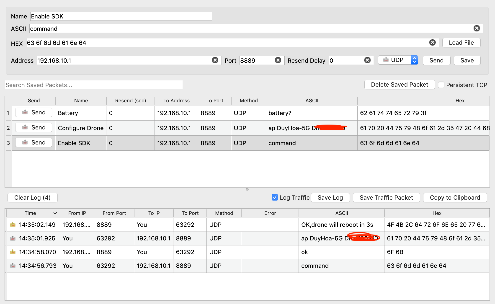

# Tello EDU drone setup

Setup cheatsheet for Tello EDU drone. This tutorial is specifically for MacOS for now

## Connect Tello EDU to Wifi access point

These steps are to connect your drone to the same network with your workstation machine (eg: your Mac) for controling it from your machine

### Install a `Packet sender` tool on your Laptop

```bash
brew update
brew cask install packetsender
```

### Configure the drone to be in SDK mode and connect it to the wifi network

Turn on the Drone, connect your Mac to the Done's wifi SSID, eg `TELLO...`. 

Launch the `Packet Sender` application, execute the command below in order: `command`, `ap <your-wifi-ssid> <your-wifi-password>`



The Drone will restart and once it starts up, it connects to your wifi access point through which, you can connect to and control the Drone from your Mac. You need to know the Drone's IP address in your network (by using tool like `arp -a` or simply access to your wifinetwork's admin pannel to spot the ip address from the list of devices connected to your network)
